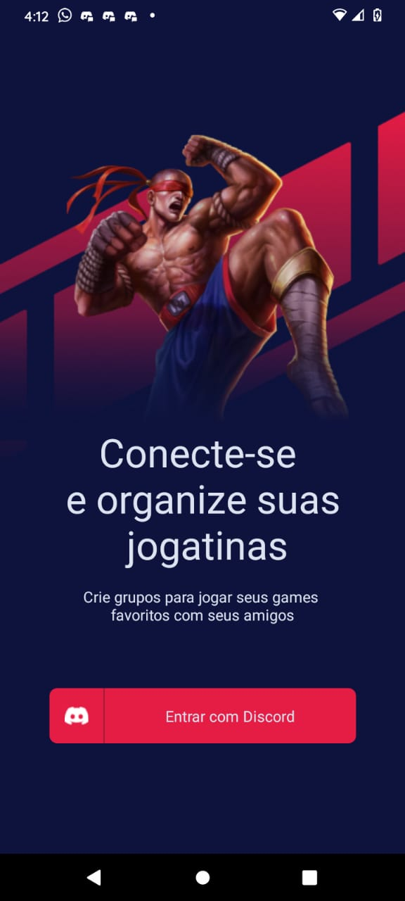

<h1 align="center">🎮 Gameplay</h1>
<p align="center" id="objetivo">Implementation made during a Next Level Week that consists of a mobile application where the user can connect and organize times to play with friends.</p>

<div align="center" gap="10px">
  
  
  
</div>

<h1 align="center">
    <a href="https://reactnative.dev/">  React Native</a>
</h1>
<p align="center">🚀 React Native combines the best parts of native development with React, a best-in-class JavaScript library for building user interfaces.</p>

<p align="center">
 <a href="#layout">Layout</a> •
 <a href="#features">Features</a> •
 <a href="#roadmap">How it works</a> • 
 <a href="#tecnologias">Tech Stack</a> • 
 <a href="#author">Author</a>
</p>

<h4 align="center"> 
	🚧  React Native App 🚀 In progress...  🚧
</h4>

<div style='margin: 20px' id="layout">
  <h1 align="center">
    
  </h1>
</div>

### Features

<div id="features">

- [x] Day 01 - Overview about react native. features: SignIn page.
- [x] Day 02 - Component for gradient theme, custom fonts, navigation, componentization, Images: Svg. Lists: ScrollView and FlatList.
- [x] Day 03 - Forms, best practices for scrolling, formatted inputs, layout adjustments, navigation to create the schedule, Modal to list server details.
- [x] Day 04 - Autenticação com Oauth2, contextos, rotas privadas.
- [ ] Day 05 -
</div>

<div id="roadmap">

### Pre-requisites

Before you begin, you will need to have the following tools installed on your machine:
[Git](https://git-scm.com), [Node.js](https://nodejs.org/en/).
In addition, it is good to have an editor to work with the code like [VSCode](https://code.visualstudio.com/)

### 🎲 Running the mobile application (FrontEnd)

```bash
# Clone this repository
$ git clone <git@github.com:danhenriquex/Rocketseat-Nlw-Together-Native.git>

# Access the project folder in your terminal/cmd
$ cd Rocketseat-Nlw-Together-Native

# Install the dependencies
$ yarn install

# Run the application in development mode
$ expo start


```

</div>

<div id="tecnologias">

### 🛠 Tech Stack

The following tools were used in the construction of the project:

- [Expo](https://expo.io/)
- [Node.js](https://nodejs.org/en/)
- [React](https://pt-br.reactjs.org/)
- [React Native](https://reactnative.dev/)
- [TypeScript](https://www.typescriptlang.org/)
</div>

### Author

---

<!-- <script type="text/javascript" src="https://platform.linkedin.com/badges/js/profile.js" async defer></script> -->

<div align="left" id="author">

<a href="https://github.com/danhenriquex">
  
</a>

<!-- <div class="LI-profile-badge"  data-version="v1" data-size="medium" data-locale="pt_BR" data-type="vertical" data-theme="dark" data-vanity="danilo-henrique-santana"><a class="LI-simple-link" href='https://br.linkedin.com/in/danilo-henrique-santana?trk=profile-badge'>Danilo Henrique</a></div> -->
</div>

<div style="margin-top: 20px" >
  <a href="https://www.linkedin.com/in/danilo-henrique-480032167/">
    
  </a>
</div>
